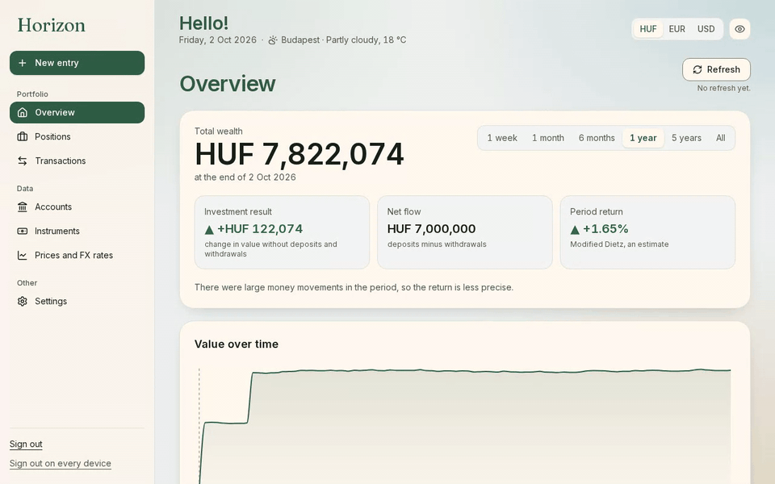
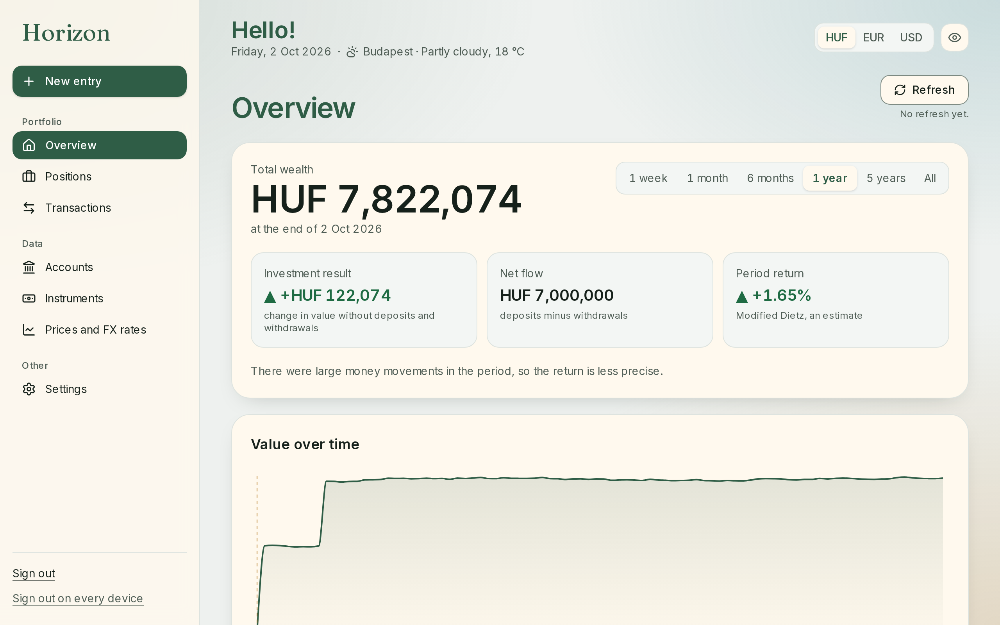
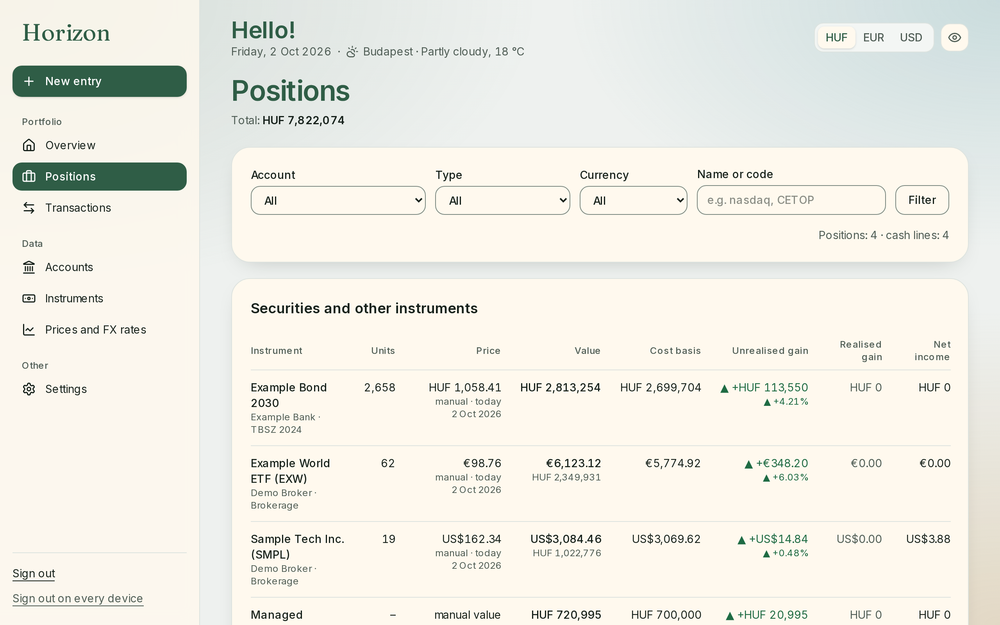
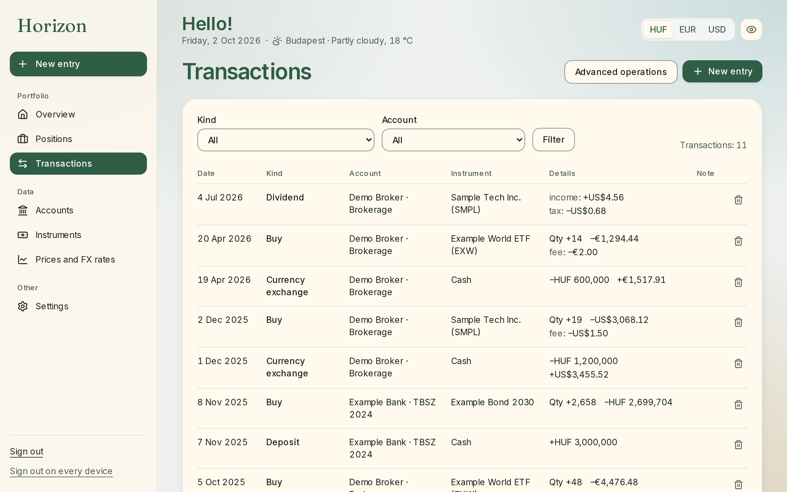
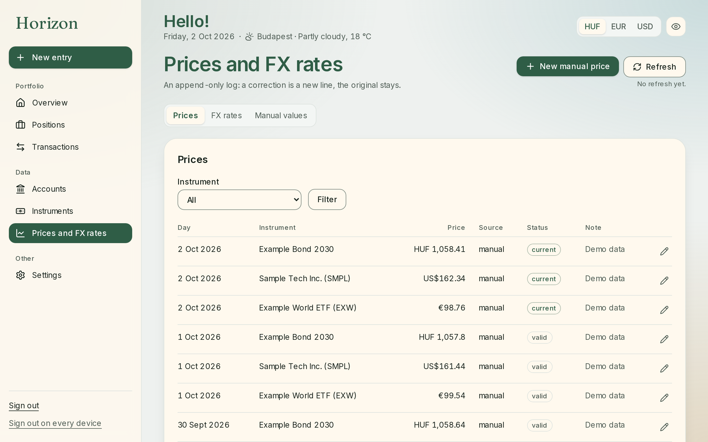

# Horizon

Horizon is a personal portfolio tracker for people who hold investments across several accounts, currencies and asset classes. It brings holdings, account cash, transactions and portfolio history into one view.



All data shown in the screenshots and preview is fictional. The screenshots show the full Horizon interface; the preview uses these same screens with read-only sample data.

| | |
| :---: | :---: |
|  |  |
|  |  |

## Try the demo

**[Try the live demo](https://horizon-portfolio-tracker.vercel.app/)** in your browser.

The preview uses the full Horizon interface in read-only mode. No account or database is required, and it uses fictional data without making requests to external services. **Reset demo** clears display preferences and returns to the overview.

To run it locally:

```bash
npm ci
DEMO_MODE=true NEXT_PUBLIC_DEMO_MODE=true npm run dev
```

Then open [http://localhost:3100](http://localhost:3100).

## Product and engineering decisions

- **Start from the user's task.** The main entry flow records a buy or sale and keeps related account and instrument details close to the form.
- **Keep estimates visible.** Prices and exchange rates are logged over time; portfolio results are labelled as analysis estimates, not tax figures.
- **Measure before integrating.** External data sources were probed before their behaviour shaped the application, and invented responses are used in tests.
- **Separate the showcase from account data.** The preview uses the application's actual screens with bundled fictional data. It blocks write requests and does not call Supabase or external providers.

The application code also includes a Supabase-backed mode. Its access model uses verified TOTP and database Row Level Security. Database tests reject any target whose hostname is not a loopback address, and CI starts a disposable local Supabase instance for those tests.

## Technology

Next.js App Router · TypeScript · Supabase · PostgreSQL · Vitest · Playwright

## Development and checks

```bash
npm ci
npm run lint
npm run typecheck
npm test
npm run test:e2e:demo
```

The database checks require the Supabase CLI and Docker. Start the local stack, load its disposable credentials, then run the RLS and authentication tests:

```bash
npx supabase start -x realtime,storage-api,imgproxy,postgres-meta,studio,edge-runtime,logflare,vector,supavisor
eval "$(scripts/local-supabase-env.sh)"
npm run test:db
```

The test guard permits loopback hosts only. Do not point the database tests at a hosted Supabase project.

## AI-assisted development

AI tools supported implementation and code review. I set the product scope and financial rules, reviewed the changes, and made the final project decisions.

## Licence

Released under the MIT Licence. See [LICENSE](LICENSE).

## Magyar összefoglaló

A Horizon személyes portfóliókövető, amellyel több számlán, devizában és eszközosztályban tartott befektetés követhető egy helyen. Megjeleníti az állományokat, a számlapénzt, a tranzakciókat és a portfólió alakulását.

A [böngészős demó](https://horizon-portfolio-tracker.vercel.app/) a Horizon tényleges képernyőit mutatja kitalált adatokkal, csak olvasható módban. Nem kell hozzá fiók vagy adatbázis, nem kapcsolódik külső szolgáltatáshoz, és az írási kéréseket letiltja. A „Demó visszaállítása” törli a megjelenítési beállításokat, és visszatér az Áttekintéshez. Az éles alkalmazás Next.js App Router, TypeScript, Supabase és PostgreSQL technológiákra épül; a hitelesítést ellenőrzött TOTP-kód, az adatbázis-hozzáférést Row Level Security védi.
